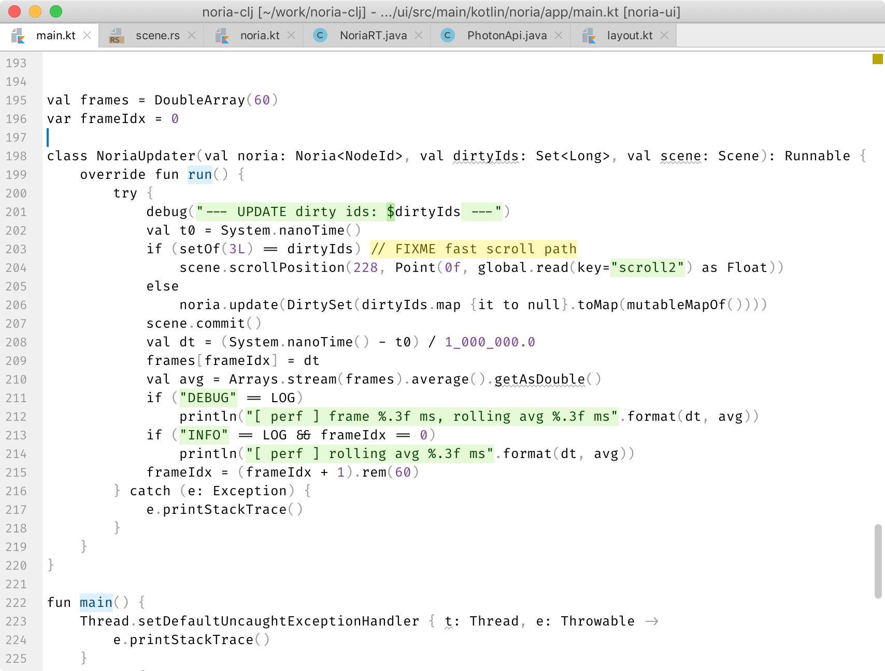
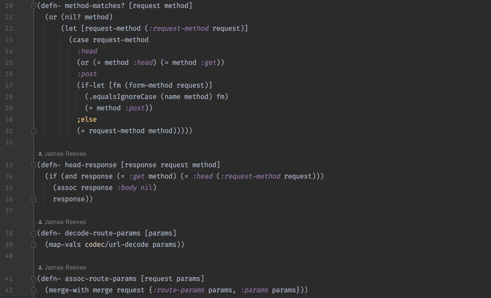
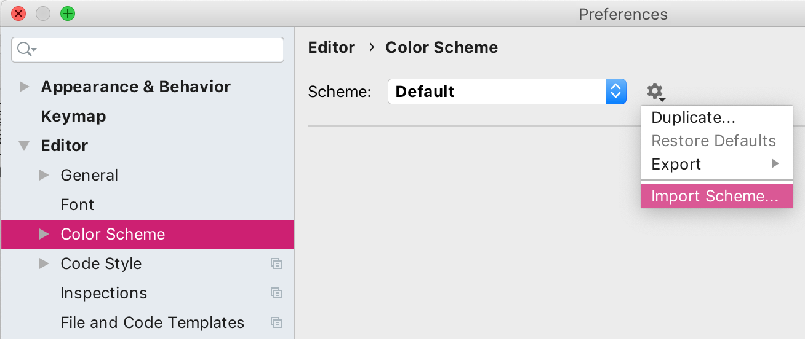

# Alabaster Color Scheme

A light & dark color schemes with minimal amount of highlighting for IntelliJ IDEA.

For motivation, see [sublime-scheme-alabaster](https://github.com/tonsky/sublime-scheme-alabaster).

Alalbaster for IntelliJ is fine tuned for:

- Clojure
- Java
- Kotlin
- Rust

Other languages work perfectly fine as well, but may do some extra unnecessary highlighting in some language-specific places.

## Installation

1. Download [Alabaster.icls](https://raw.githubusercontent.com/tonsky/intellij-alabaster/master/Alabaster.icls).
2. Import through Preferences → Editor → Color scheme → Import Scheme...

## License

[MIT License](./LICENSE.txt)

## Variations

- Version for Sublime Text [tonsky/sublime-scheme-alabaster](https://github.com/tonsky/sublime-scheme-alabaster)
- Version for Visual Studio Code [tonsky/vscode-theme-alabaster](https://github.com/tonsky/vscode-theme-alabaster)
- for JetBrains IDEs as a plugin [vlnabatov/alabaster-theme](https://github.com/vlnabatov/alabaster-theme)
- for JetBrains IDEs as a plugin (dark version) [vlnabatov/alabaster-dark-theme](https://github.com/vlnabatov/alabaster-dark-theme)
- Version for Vim [agudulin/vim-colors-alabaster](https://github.com/agudulin/vim-colors-alabaster)
- Alternative version for Sublime Text 2 [freetonik/Travertine](https://github.com/freetonik/Travertine)
- Dark version for VS Code [apust/vscode-rubber-theme](https://github.com/apust/vscode-rubber-theme)
- Original version for LigthTable [tonsky/alabaster-lighttable-skin](https://github.com/tonsky/alabaster-lighttable-skin)
- Version for [CudaText](https://sourceforge.net/projects/cudatext/files/addons/themes/theme.Alabaster.zip/download)

## Changelog

### July 2, 2019

Fine-tuned for Kotlin and Rust. Added a hint of foreground color to stuff that is background highlighted

### April 10, 2019

Initial
